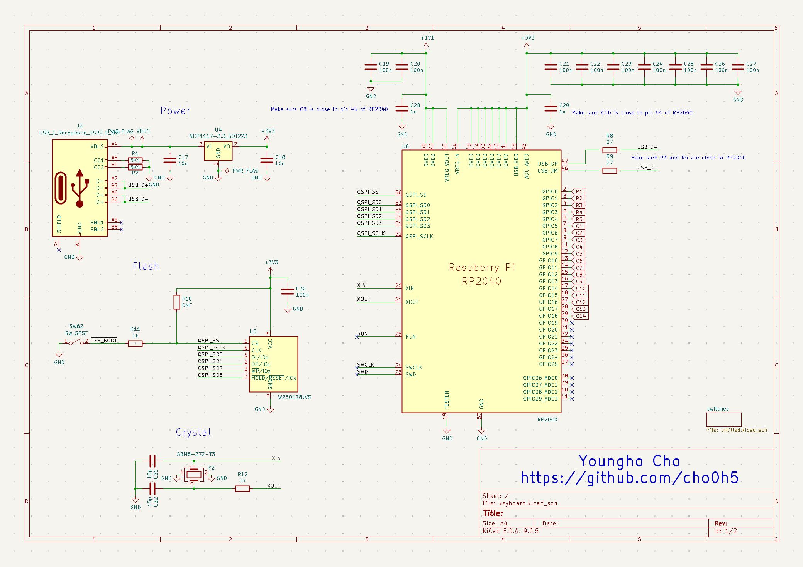
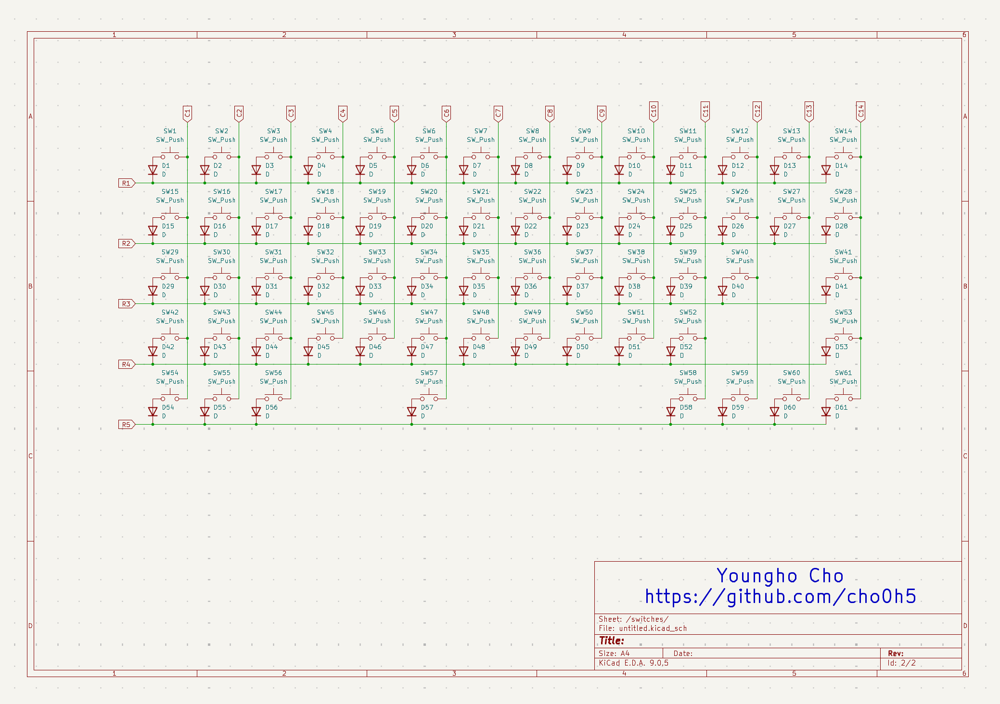
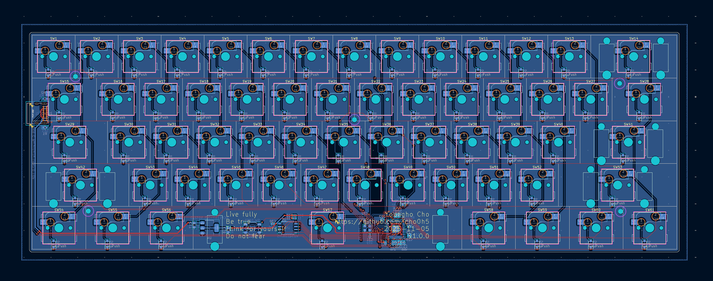
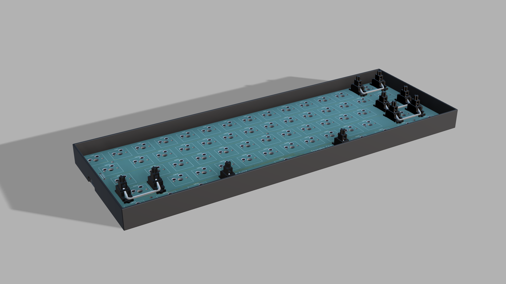
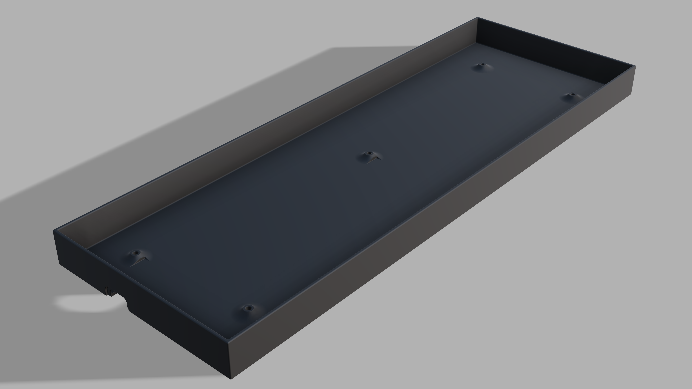
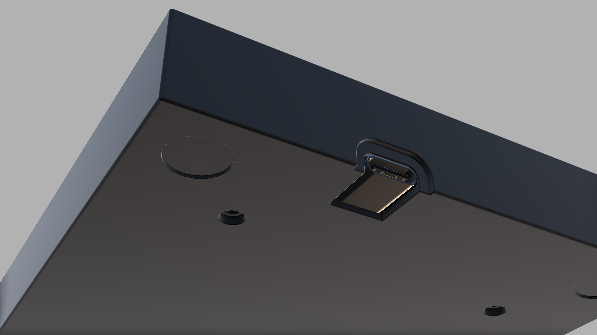
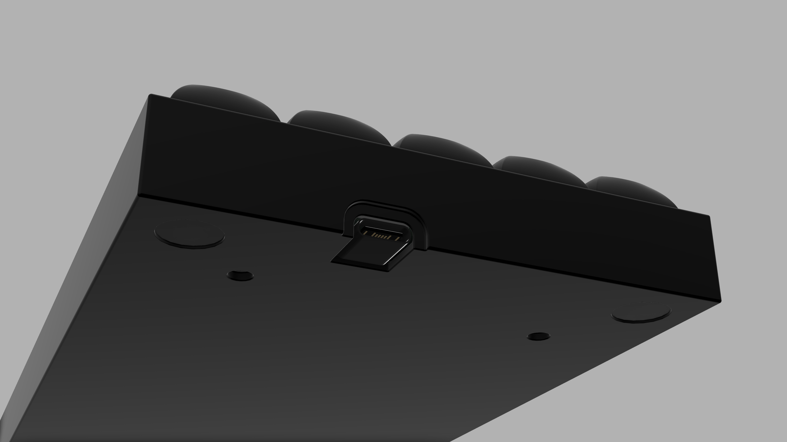
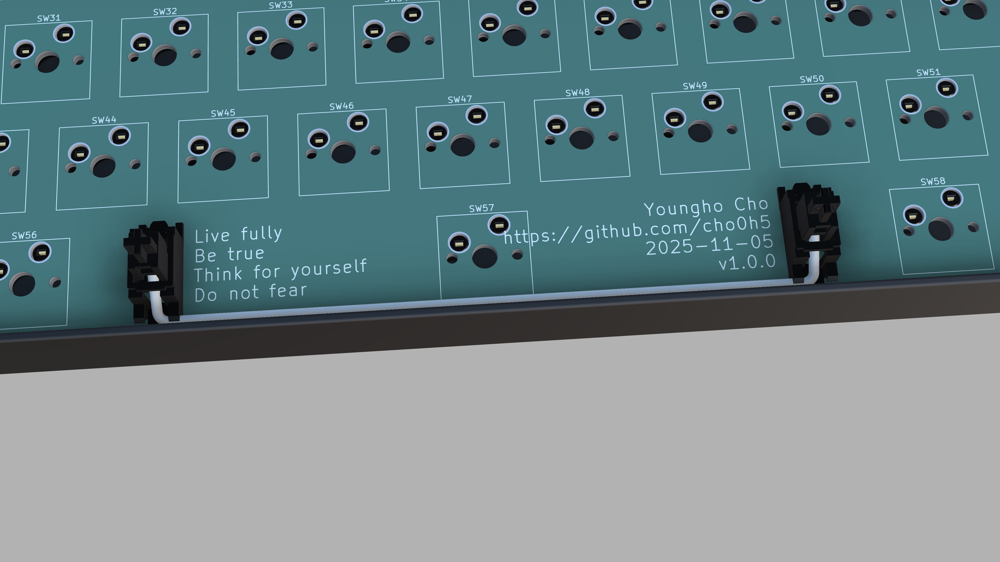

# Keyboard Project

## Schematic

## PCB Layout

## 3D Rendering

### 3D Models Used
- Cherry MX Switch: [ConstantinoSchillebeeckx/cherry-mx-switch](https://github.com/ConstantinoSchillebeeckx/cherry-mx-switch)
- DSA Keycap: [anhthang/dsa-keycap](https://github.com/anhthang/dsa-keycap)
